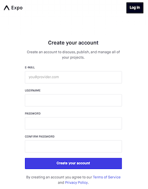
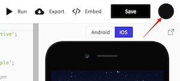
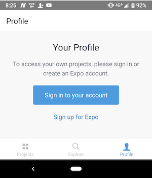

expo snackを使うことで、ブラウザだけでReactNativeの開発環境を構築できます。
パソコンには何もインストールする必要がありません。

# やること
- expo / expo snackを使うために、expoアカウントを作成する
- expo clientをスマホにインストールする

# 手順

## expoアカウントを作成する
- https://expo.io/signup を開いて、適当なユーザ名やパスワード、メールアドレスを入力してアカウントを作成してください。
 

- メールが届くので、リンクを開いてアカウントを有効にします。
- https://snack.expo.io を開いて、右上の黒丸を押して"Log in"を選択し、ログインを先ほどのアカウントでログインしてください。

- 続いて"Save"ボタンを押し、適当な名前をつけてください。

## expo clientをスマホにインストールする

- それぞれのOSのクライアントをストアからダウンロードしてください。

### iOS
- https://itunes.apple.com/app/apple-store/id982107779

### Android
- https://play.google.com/store/apps/details?id=host.exp.exponent

## expo clientのログイン
インストールした"Expo"アプリを起動後、右下の"Profile"タブを選択して「Sign in to your account」を押してログインしてください。

